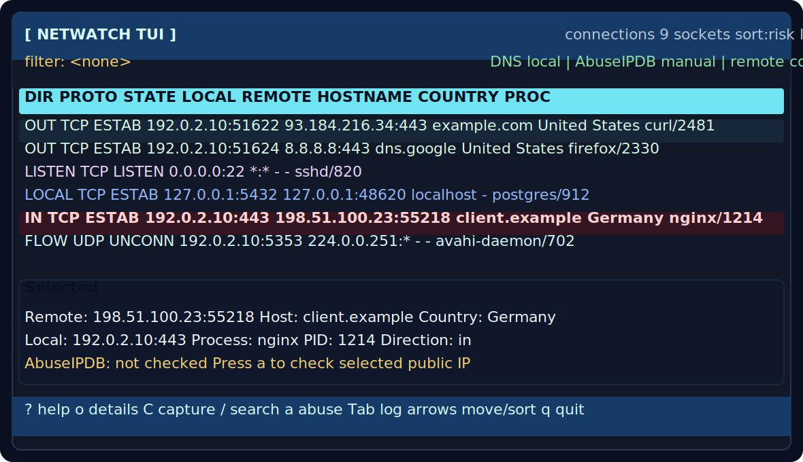

# Netwatch TUI

A terminal dashboard for Ubuntu/Linux that shows active TCP and UDP connections, resolves hostnames, enriches country data when available, and lets you manually check selected public IPs with AbuseIPDB.

## Preview



The preview uses representative sample data. Live rows depend on the sockets, process permissions, DNS results, and optional lookups available on the host running Netwatch.

## What it shows

- Active inbound, outbound, local, and listening sockets
- Local and remote addresses and ports
- Process name and PID when available
- Reverse DNS hostnames
- Country data from local GeoIP tooling, with optional remote fallback
- Manual AbuseIPDB lookup results
- A local lookup log you can view inside the TUI
- Incident-response snapshots of the current connection/process state
- A scrollable detail view for selected connections

## Why sudo is needed

Linux only exposes full process ownership for many sockets to privileged users. Netwatch uses `sudo` so `ss -tunap` can show which process and PID owns each connection. Without that, the connection list is less useful because many process names are hidden.

Netwatch does not run network checks as root. Sudo is used for socket/process visibility.

## Install

Requirements:

- Ubuntu or another Linux system with `ss` from `iproute2`
- Python 3.9+
- `sudo`

Optional:

```bash
sudo apt install geoip-bin geoip-database
```

That enables local country lookup through `geoiplookup`. Without it, country data shows as `-` unless you enable the remote country fallback in the TUI.

## Run

```bash
chmod +x netwatch_tui.py
./netwatch_tui.py
```

On startup, Netwatch asks whether to add, use, change, or skip an AbuseIPDB API key. The key is stored at:

```text
~/.config/netwatch-tui/config.json
```

The file is written with user-only permissions.

## Controls

| Key | Action |
| --- | --- |
| `Up` / `Down` or `j` / `k` | Move through rows or scroll current view |
| `PgUp` / `PgDn` | Move faster through rows or scrollable views |
| `Left` / `Right` or `h` / `l` | Move column focus |
| `Enter` | Sort by focused column |
| `s` | Cycle common sort modes |
| Mouse click header | Sort by clicked column |
| Mouse click row | Select row |
| `o` | Open connection detail view |
| `/` | Search/filter |
| `c` | Clear search |
| `a` | Check selected remote public IP with AbuseIPDB |
| `C` | Capture current connection/process snapshot |
| `Tab` | Switch between connections and lookup log |
| `g` | Toggle remote country fallback |
| `p` | Pause/resume refresh |
| `r` | Refresh/reload current view |
| `K` | Show API-key restart note |
| `Esc` | Leave search/detail/help where supported |
| `?` | Show in-app help |
| `q` | Quit |

## Search

Press `/` and type. Search filters live as you type.

Examples:

```text
firefox
1.1.1.1
Germany
ESTAB
port:443
:443
lport:22
rport:443
```

`Enter` or `Esc` leaves search mode while keeping the filter active. `Ctrl-U` clears the current search text while typing.

## Incident response

Press `C` to capture the current state. This is a JSON/text snapshot feature, not packet capture, and it does not write PCAP files. Netwatch writes timestamped files under:

```text
captures/
```

Each snapshot includes current connections, enriched fields, raw `ss` output, and process metadata for visible PIDs. Process metadata includes executable path, command line, cwd, selected `/proc/status` fields, socket file descriptors, executable file metadata, and SHA-256 where readable.

Environment variables are intentionally not captured because they often contain secrets.

Open a connection detail view with `o`. Use `Esc` or `o` to return.

## AbuseIPDB behavior

Netwatch only performs lookups. It does not report IPs.

A lookup happens only when you select a connection and press `a`. The selected remote IP must be public. Lookup history is appended to:

```text
abuseipdb_lookups.jsonl
```

The file is ignored by Git by default because it may contain private network investigation history. Capture files under `captures/` are ignored for the same reason.

## Privacy notes

- Reverse DNS uses your system resolver.
- AbuseIPDB is contacted only when you press `a` on a selected public IP.
- Remote country lookup is off by default and can be toggled with `g`.
- API keys are not written to logs.
- Lookup logs are local JSONL files.

## Development

Syntax check:

```bash
python3 -m py_compile netwatch_tui.py
```

The project intentionally uses only the Python standard library.
